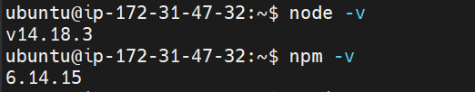
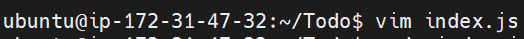
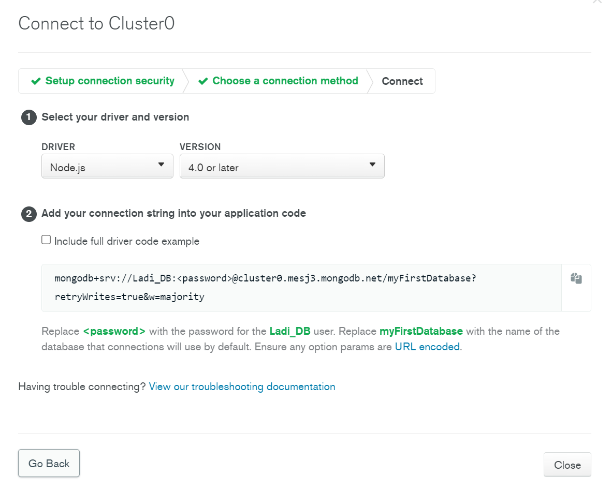
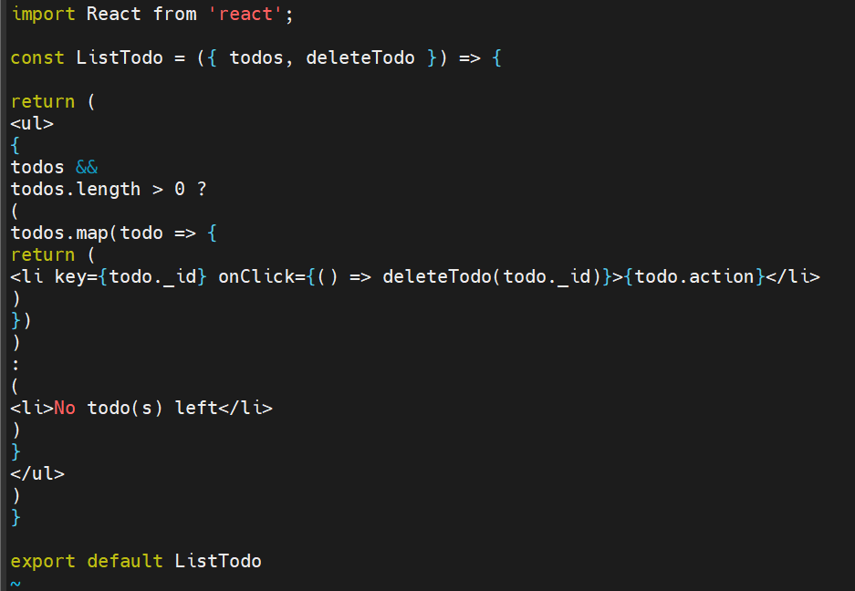

# MERN STACK IMPLEMENTATION

## BACKEND CONFIGURATION

Update ubuntu 

`sudo apt update`

Upgrade ubuntu

`sudo apt upgrade`

Get Node.js location from ubuntu repositories

`curl -sL https://deb.nodesource.com/setup_12.x | sudo -E bash -`

Install Node.js 

`sudo apt-get install -y nodejs`

Verify node installation 

`node -v`

`npm -v`

--------------

**TO-DO APPLICATION SETUP**

Create new directory and initalize project 

`mkdir Todo`

`npm init`

Configure package.json file

Run ls to confirm package.json 

---------
Install Expressjs 

`npm install express`

Create a file index.js and check with ls

`touch index.js`

`ls`

Install dotenv

`npm install dotenv`

Open index.js

`vim index.js`

Add the code below into the file

Start server 

`node index.js`

Add inbound rule to allow access via tcp port 5000 in EC2 security groups

Access server via browser

**Create routes that will manage To-do application**

`mkdir routes` 

Create file api.js 

`touch api.js`

open api.js

`vim api.js`

Add the code below in api.js

------------------

**Create models**

Install mongooose

`npm install mongoose`

In Todo directory create folder models

`mkdir models`

Create file todo.js

`touch todo.js`

open todo.js

`vim todo.js`

Add the code below

Open and update api.js file with below code

`vim api.js`

-------------

### Create MongoDB database and collection

In Todo directory create and open file .env

`touch .env`

`vi .env`

Add the connection string

`DB = 'mongodb+srv://<username>:<password>@<network-address>/<dbname>?retryWrites=true&w=majority'`

 Update the index.js file to reflect the use of .env so that Node.js can connect to the database.

 `vim index.js`

update code with below configuration 
 

Start server 

`node index.js`

**Test Backend Code without Frontend using RESTful API**

Using postman to test API

Create a POST request to the API http://<PublicIP>:5000/api/todos

set header key as content-type and value as application/json

Create GET request to API http://<PublicIP>:5000/api/todos

------------

## FRONTEND CONFIGURATION

Use the create-react-app command to scaffold our app

in Todo directory run `npx create-react-app`

**RUNNING REACT APP**

Install concurrently 

`npm install concurrently --save-dev`

Install nodemon

`npm install nodemon --save-dev`

In Todo directory open and edit package.json file changing the script config

In client directory open and edit package.json file

Add the key value pair in the package.json file 
`"proxy": "http://localhost:5000"`

In the Todo directory run `npm run dev`

Add rule for tcp port 3000 in EC2

Applicaition running on port 3000

**Creating React Components**

In SRC folder create folder components

`mkdir components`

create the following files

`touch Input.js ListTodo.js Todo.js`

open and edit input.js

Add the below config

In clinets folder install axios

`npm install axios`

in components file open and add config

`vi listTodo.js`

open todo.js 

`vi todo.js`

Add the below config

In the src folder open App.js file

`vi App.js`

add the below configuration

Open App.css

`vi App.css`

Add below config

open index.css

`vim index.css`

Add the below config

In Todo directory run

`npm run dev`

Reload server on port 3000
 

